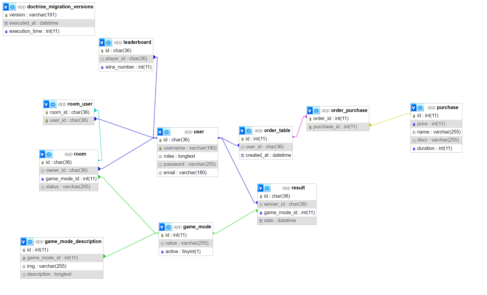

# Kard

Kard est un jeu de cartes en ligne. Il permet de jouer à plusieurs jeux de cartes en direct avec d'autres joueurs.

## Contexte

Devoir pour l'ESGI et @BaptisteVasseur ([sujet](https://github.com/BaptisteVasseur/cours-symfony/blob/main/sujet-projet-symfony.md))

## Installation

```bash
git clone git@github.com:Fan2Shrek/kard.git
cd kard
make start
```

## Users

| Login  | Password | Role        |
| ------ | -------- | ----------- |
| admin  | aaa      | ROLE_ADMIN  |
| user   | aaa      | ROLE_USER   |
| banned | aaa      | ROLE_BANNED |

Ensuite allez sur [localhost:8000](http://localhost:8000) et vous êtes prêt à jouer !

## Stack technique

- Symfony 7
- React (avec Symfony UX)
- Stimulus
- Turbo
- Mercure
- Docker
- EasyAdmin

## Schéma de la base de données


